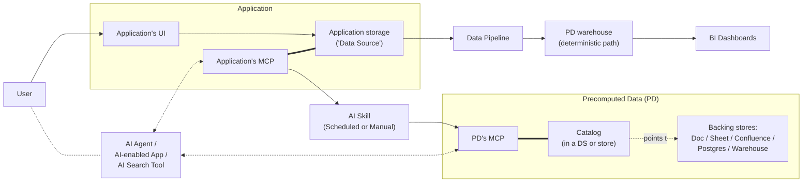
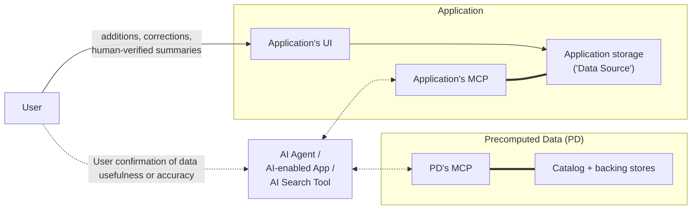

# **Short Architecture Brief: Institutional Knowledge for AI Enablement**

## **1. Purpose**

This architecture describes a simple, versatile approach for making institutional knowledge available to AI agents, AI-enabled applications, search platforms, and people across the organization.

The core goal is **AI-enablement through data democracy**: make it easier for authorized users and tools to find relevant, trusted, and up-to-date knowledge without requiring every AI agent or application to perform expensive, repetitive, and error-prone searches across every source system.

The architecture keeps institutional knowledge in the data sources where it belongs, while using a lightweight layer of **Precomputed Data**, or **PD**, to make common discovery, prioritization, and retrieval tasks faster and more reliable.

PD is a **logical role**, not a particular database. It is the precomputed data that helps tools find trusted, current, relevant knowledge — plus a catalog of where that precomputed data lives. That role can be realized on a spectrum of backing stores chosen per output type and scale: a Google Sheet, Confluence page, or Drive doc at small scale; Postgres or BigQuery at large scale.

As a concrete small-scale example: a skill reads a project's Jira tickets, Slack threads, and Confluence pages and writes a computed project summary into a **Google Doc**, marked as AI-generated. A separate **Google Sheet** serves as the catalog — one row per artifact, recording the precompute type (`project-summary`), the subject (`project: Atlas`), and the location (the Doc's URL), along with freshness and access-control metadata. An AI agent asked about Project Atlas reads the catalog Sheet, finds the row, and follows the link to the Doc — one lookup instead of re-searching Jira, Slack, and Confluence. Here PD owns no database at all: the computed data lives in a Doc and the catalog lives in a Sheet, both ordinary DSs. The skill writes them under its own Google account, and authorized people can edit the catalog directly under their SSO identity — every change attributed and reversible through the Sheet's version history.

A secondary goal is **operational BI and reporting**: a deterministic data pipeline can also feed dashboards and structured reporting outputs. This is an explicit, stated goal to capture the deterministic data pipeline (DSs → Pipeline → warehouse → BI Dashboards) that this architecture is inspired by. The warehouse is one realization of PD's backing store — appropriate for the deterministic BI path — not a requirement of the architecture as a whole.

---

## **2. Core Concepts**

### **Data Sources, or DSs**

Data Sources, or **DSs**, are the systems where institutional knowledge is created, maintained, corrected, summarized, governed, and accessed.

Examples include:

* Google Drive
* Confluence
* Jira
* GitHub
* Slack
* Gmail
* Google Calendar
* Google Meet recordings
* Zoom recordings
* Workday
* Greenhouse
* Unanet
* Salesforce
* Figma

In this model, **new durable knowledge should be added to a DS**, such as a Confluence page, Google Doc, Jira ticket, or other appropriate source system.

Similarly, **data corrections should happen in a DS**, not in PD.

Human-verified summaries should also be added to a DS. For example, a project summary might live in Confluence, a Google Doc, or a project-specific source of truth.

This keeps the architecture simple: DSs remain the places where people create, edit, correct, summarize, and govern institutional knowledge.

### **Precomputed Data, or PD**

**Precomputed Data**, or **PD**, is a computed layer derived from DSs. It is a **logical role**, not a single store: it comprises the computed outputs that speed up retrieval, plus a **catalog** that tells tools where each kind of computed output lives.

PD content may include:

* Aggregations across DSs.
* Indexes over DS content.
* Categorization metadata.
* Prioritized pointers to relevant DS records.
* Freshness and trust metadata.
* Obsolescence indicators.
* Data confirmation signals.
* Search optimization metadata.
* Retrieval hints for common question patterns.
* Access-control metadata propagated from DSs.

PD helps AI agents and applications avoid spending unnecessary time, tokens, and effort searching across many systems, following dead ends, or repeatedly recomputing common retrieval signals.

#### **Pluggable backing store**

PD is realized on whatever store fits the output, chosen along two axes — **who consumes it** and **how much integrity it requires**:

* **Human-readable computed artifacts** — summaries, digests, curated indexes meant for people to read — may live in any DS where people already work (a Google Doc, a Confluence page). They must be **provenance-marked as AI-generated** (see Section 8) so they are not mistaken for human-verified knowledge and so skills do not later recompute on their own output.
* **Integrity-critical signals** — confirmations and trust metadata that influence ranking for all users — must live in a store fronted by a service that can enforce **verified-SSO identity, rate-limiting, and provenance** (see Section 4.4). A bare Sheet or Doc cannot enforce any of that, so these signals require a real store (e.g., Postgres) with an application in front. "Any store" holds for human-readable artifacts; it does **not** hold for integrity-critical signals.
* **Machine retrieval signals** — indexes, pointers, retrieval hints — are read by no human; the choice of Sheet vs. Postgres vs. BigQuery here is a storage-engine decision driven by scale, not an architectural one.

#### **The catalog**

Because PD outputs may be distributed across several stores, a **catalog** records where each kind of precomputed data lives (`precompute-type + subject → location`). Agents read the one catalog, then follow pointers to the right store. The catalog may itself be stored in a DS — a Google Sheet, Confluence page, or Drive doc — so that no dedicated warehouse is required for a small deployment.

The catalog is the new single point of discovery, but it does not require a bespoke write-governance regime. When the catalog lives in a **version-history DS** (Google Sheets, Confluence), it is treated as **just another DS artifact**: any user with edit access may write it, edit access is governed by the artifact's native sharing (a Google Group), every write is attributed to the writer's SSO identity and logged by the DS's **version history** (who / when / what), and a bad edit is recovered by reverting.

Writers — humans and the skill alike — are ordinary editors. When an automated process or skill writes the catalog and no human attribution is wanted, it uses an ordinary **Google account with its own email address** (`summarizer@navapbc.com`) that behaves like any other human editor: it appears in version history under that email and is governed only by the artifact's native sharing.

This relaxation is **scoped to the catalog and to versioned stores**. A catalog held in a store without native version history (Postgres, BigQuery) keeps the stricter discipline (a governed writer identity, or a built audit/rollback mechanism). It also does **not** extend to confirmation or trust signals, which remain behind an integrity-enforcing service (see below and Section 4.4).

Two properties of the catalog still need care. **Access enforcement does not trust the catalog's stored ACL metadata** — since any editor can alter a row, real access is enforced at the *target store's* native permissions (see Section 7), so a tampered ACL hint cannot widen access. And because version history is **corrective, not preventive** — a bad pointer misdirects every query that hits that subject until someone notices — the skill's regular run **validates catalog entries and dangling pointers** and re-derives the computed rows it owns, bounding the detection window. Hand-authored rows the skill did not compute are not re-derivable, so version-history revert is their only recovery.

A catalog-in-a-DS suits low-cardinality pointers (dozens to low-hundreds of subjects); large per-record pointer sets fall back to an indexed store. The logical-role framing is what lets both realizations coexist without changing the architecture.

#### **Recomputable vs. durable PD**

Most PD content is **recomputable**: indexes, aggregations, categorization, retrieval hints, the catalog, and propagated access-control metadata can all be rebuilt from DSs if PD is deleted.

However, **data confirmation signals** (see Section 8) originate in PD from user feedback and do not exist in any DS. They are **durable PD-origin data**, not recomputable output, and therefore require their own backup and retention. The "rebuild from DSs" property applies only to the recomputable subset; durable PD-origin data must be preserved independently — which is a further reason it lives in an integrity-enforcing store rather than a Sheet.

---

## **3. Design Principles**

### **Keep DSs authoritative**

DSs remain the source of truth. Durable additions, corrections, and human-verified summaries happen in DSs, not in PD.

### **Keep PD computed**

PD stores computed outputs, indexes, aggregations, categorization metadata, trust signals, freshness indicators, confirmation signals, and the catalog that locates them.

It should not become a manually maintained knowledge base. This holds even when a PD artifact physically lives in a DS (for example, an AI-generated summary in a Google Doc): such artifacts are computed output that happens to be stored in a DS, are provenance-marked as AI-generated, and are not the human-authored source of truth.

### **Choose the backing store per output type**

PD is a logical role with a pluggable backing store. Pick the store by consumer and integrity need, not by default: human-readable artifacts where people read them, integrity-critical signals behind an enforcing service, machine signals wherever scale dictates. Keep the catalog as the one known place to discover all of it.

### **Keep access control simple**

Role-based access should use existing Google access control wherever possible.

Access should be implemented by:

1. Adding users to Google Groups.
2. Attaching those Google Groups to particular data in DSs.
3. Propagating the relevant access-control metadata from DSs into PD.
4. Enforcing those permissions when PD is queried.

**Per-DS ACL mapping is required.** Most DSs do not natively express permissions as Google Groups — Slack uses channel membership, Jira/Confluence use Atlassian roles and permission schemes, Salesforce uses profiles and sharing rules, and Workday/Greenhouse/Unanet use their own role models. For each DS, document whether native Google-Group attachment is possible and, where it is not, define how that system's native ACLs are normalized into the propagated access-control metadata. For the majority of DSs the admin mapping process below is the **primary** mechanism, not an exception, and should be scoped as such.

When it is not possible to attach a Google Group directly to particular data in a DS, an admin mapping process applies Google Group access controls when defined criteria are met. This process must have a **named owner**, must **default to deny** for any record that matches no criterion (records are never ingested as world-readable by default), and must define **conflict resolution** when multiple criteria apply (most-restrictive wins). Example criteria include:

* Data comes from a particular DS.
* Data has a particular tag or label.
* Data belongs to a particular category.
* Data is associated with a particular project, client, team, or business function.
* Data matches a governance rule requiring restricted access.

This avoids creating a separate RBAC system while still allowing access controls to be applied consistently across heterogeneous DSs.

### **Keep identity simple**

#### Read access

Identity is established by **Google SSO**. An email address is an identifier, not an authenticator — it must never be accepted as a self-asserted parameter at a trust boundary. For read-only access, MCP services require a **verified Google OIDC/OAuth token** (audience-validated); the verified email *claim* from that token is what determines which DS and PD data the user can access. The authenticated identity must be carried across each agent → MCP → PD hop (e.g., token passthrough or an on-behalf-of flow) so PD never trusts an unverified email string. This requirement applies equally to invocations from AI agents and from automation tools such as Zapier.

#### Write access to DSs

For write access to DSs, the user's verified SSO identity is likewise used. Users make additions, corrections, and human-verified summaries directly in DSs using their own identity and the DS's normal permissions.

#### Write access to PD

Write access to PD depends on the backing store, not on a single rule.

* **Stores without native version history** (a warehouse, a Postgres database): a **governed writer identity** is needed for any actor that writes precomputed data, with the controls in Section 7 (least privilege, rotation, audit logging). This is the path for integrity-critical and durable PD content.
* **Catalog or artifacts in a version-history DS** (Google Sheets, Confluence): no special regime. The artifact is written like any other DS edit — by any user with native edit access, under their SSO identity, logged and reversible via version history (see Section 2). When a skill or automated process writes such an artifact and no human attribution is wanted, it uses an ordinary **Google account with its own email address** that behaves like any other editor — appearing in version history under that email, governed only by the artifact's native sharing.

Note that a skill which writes **human-readable artifacts into a DS** needs edit access to that DS — an expansion from the historical read-broad / write-PD-only skill identity. That access is the DS's native edit permission (granted via Google Group sharing), least-privilege to the locations the skill actually writes, and audited by the DS's version history (see Section 5).

### **Optimize for AI-enablement**

DSs and PD should be accessible through MCP services. MCP services are the main method AI tools use to query institutional data, and the main method skills use to write PD outputs to their chosen store.

This allows AI agents and AI-enabled applications to query DSs and PD in a consistent, permission-aware way. The goal is to make it easy for AI tools to discover useful knowledge quickly, with enough context to understand which DS records are relevant, trusted, current, and authorized.

### **Enable data democracy**

Authorized users should be able to use AI-enabled tools to access institutional knowledge without needing to know where every artifact lives or how each DS is structured.

---

## **4. Data Flows**

- DSs → Deterministic Data Pipeline → PD (warehouse realization) → BI Dashboards
- DSs → AI Skill → PD (catalog + chosen backing store, via MCP)
- MCP Services ↔ DSs
- MCP Services ↔ PD
- AI tools read the PD catalog, then follow pointers to the right store
- Confirmations go to an integrity-enforcing PD store
- Durable updates go to DSs

At a high level, the architecture has four main flows.

### **4.1 Knowledge Creation and Governance**

* Institutional knowledge is created, corrected, and summarized in DSs.
  * New durable knowledge is written to a DS.
  * Corrections are made in a DS.
  * Human-verified summaries are stored in a DS.
* Access control is managed using Google SSO and Google Groups.
  * Google Groups are attached to data in DSs where possible.
  * When direct attachment is not possible, an admin process applies group-based access rules using criteria such as DS, tag, label, category, project, or business function.

### **4.2 PD Population and Refresh**

* Access-control metadata is propagated from DSs into PD.
  * PD uses this metadata to enforce permissions when queried.
* Deterministic PD artifacts are updated by regular data pipelines.
  * This includes dashboard-related artifacts, structured aggregations, and reporting outputs, typically materialized in a warehouse.
  * These updates do not require AI involvement.
* AI-assisted PD content is updated by scheduled or manually-run AI skills.
  * The skill may compute indexes, categories, retrieval hints, freshness signals, trust metadata, and confirmation signals, and writes each to its chosen backing store via MCP.
  * The skill registers the location of each output in the catalog.
  * The skill performs staleness checks on referenced DS content, and on its own catalog pointers (a pointer can outlive the artifact it names).
  * If source data has changed, moved, been deleted, or had access controls changed, the related PD content is updated, marked stale, or removed.
  * The skill may be run directly by a user or AI agent, or exposed through an MCP service for automated invocation.

### **4.3 Query and Retrieval**

* AI agents, search tools, and AI-enabled applications query DSs and PD through MCP services.
  * MCP services are the primary query path for AI tools.
  * Read-only access requires a verified Google SSO (OIDC/OAuth) identity token; the verified email claim is used to authorize the request.
  * Query results are filtered using DS permissions and PD access-control metadata.
  * Agents read the **catalog** to discover where each kind of precomputed data lives, then follow pointers to the relevant store.
  * **Enforcement tier:** where PD is materialized in a queryable store, the PD MCP service resolves the caller's group memberships and applies them as authorized query predicates — or uses BigQuery authorized views / row-access policies keyed to the SSO identity — so that restricted rows are never returned to the AI tool before access-control filtering. Where a PD artifact lives in a DS (e.g., a summary in a Doc), that DS's native permissions are the enforcement mechanism (see Section 7). Propagated group metadata is indexed to support this filtering.
* PD helps tools identify the best DS records to retrieve.
  * It provides computed aggregations, indexes, categories, source pointers, freshness metadata, trust signals, and retrieval hints.
  * This reduces latency, token usage, duplicate searching, and dead ends.

### **4.4 User Feedback and Source Updates**

* Users may confirm whether retrieved data, rankings, or computed signals are useful or accurate.
  * These confirmation signals are stored in an integrity-enforcing PD store.
  * Confirmations may improve future ranking, trust, and retrieval behavior.
  * Because confirmations influence ranking and trust for all users, each confirmation write must carry the **verified SSO identity** of the confirming user (the same token mechanism used for reads), be **rate-limited**, and record **provenance** so confirmations can be attributed and, if needed, discounted or revoked. This prevents anonymous poisoning of the retrieval layer — and is why confirmation signals require a store fronted by an enforcing service rather than a bare Sheet or Doc.
* Durable updates happen in DSs.
  * New data is added to a DS.
  * Corrections are made in a DS.
  * Human-verified summaries are written to a DS.
* How PD writes are governed depends on the store (see Section 8).
  * PD in a non-versioned store (and all confirmation/trust signals) uses a governed writer identity.
  * A catalog or artifact in a version-history DS is written as an ordinary DS edit — native sharing, version history, SSO identity (a non-human Google account for skill writes).
  * Neither is needed for read-only access or for users writing directly to DSs.

---

## **5. PD Update Mechanisms**

PD is updated through two complementary mechanisms.

All PD updates should propagate or assign access-control metadata into PD, and register the output's location in the catalog.

### **Deterministic Data Pipelines**

For deterministic artifacts, such as dashboards and structured reporting outputs, a regular data pipeline updates PD — typically a warehouse realization — without AI involvement.

This pipeline is appropriate when the transformation logic is known, repeatable, and does not require AI interpretation.

Examples include:

* Dashboard source tables.
* Structured aggregations.
* Operational metrics.
* Standard reporting indexes.
* Scheduled extracts from DSs.

### **AI Skills**

For AI-assisted or interpretation-heavy computed content, PD is updated by a scheduled or manually-run AI skill.

The skill is responsible for:

* Reading appropriate DS content.
* Respecting DS access-control metadata.
* Computing indexes and aggregations.
* Categorizing DS content.
* Detecting freshness and obsolescence signals.
* Performing staleness checks on referenced source data and on its own catalog pointers.
* Determining whether PD content needs updating.
* Choosing the appropriate backing store for each output (see Section 2) and writing to it via MCP.
* Registering each output's location in the catalog.
* Provenance-marking any human-readable artifact it writes into a DS as AI-generated.
* Rebuilding PD content when needed.
* Updating trust and confirmation metadata.

When rebuilding or refreshing PD content, the skill must check the staleness of referenced source data. If the DS content referenced by PD has changed, been deleted, moved, had access controls changed, or otherwise become stale, the relevant PD content should be updated, marked stale, or removed.

**Skill identity and scope.** The skill is the most privileged *reader* in the system: it reads broadly across DSs. Its read identity and scope must be defined explicitly and per DS, following least privilege — only the read access required for the DSs it processes. The skill must capture each item's **source access-control metadata at read time** so that every derived PD artifact is stamped with the correct ACL; failure to do so silently widens access.

The skill's **write** posture depends on the target (see Section 8): for stores without version history it uses a governed writer identity with the Section 7 controls; for a catalog or artifact in a version-history DS it writes as an ordinary editor under a **Google account with its own email** (granted native edit access via Google Group sharing, least-privilege to the locations it writes), with the DS's version history serving as the audit log. Reads, and writes to non-versioned stores, must be **audit-logged** for security; writes to version-history DSs are audited by that history.

Because version history is corrective rather than preventive, the skill's regular run also **validates catalog entries and dangling pointers** and re-derives the computed rows it owns, bounding the window in which a bad human or machine edit can misdirect queries.

---

## **6. Application and Agent Access**

AI agents and AI-enabled applications may query institutional data to answer questions, generate content, retrieve context, or help users navigate organizational knowledge.

The primary query path is through MCP services connected to DSs and PD. Tools read the PD catalog to locate the precomputed data they need, then follow pointers to the relevant store.

Examples include:

### **Simple AI Agent**

A locally run Claude Cowork-style agent with connectors or MCP services for approved DSs and PD. It can answer user questions by querying DSs and using PD to quickly identify likely relevant records.

### **Commercial AI-Enabled Apps**

Examples include:

* Glean
* GoSearch
* SearchUnify

These products may provide enterprise search, AI answers, knowledge discovery, and content generation over connected DSs and PD.

### **Self-Hosted Search and AI Platforms**

Examples include:

* Onyx Community Edition
* PipesHub
* SWIRL

These platforms may provide an internal search and retrieval layer over DSs, optionally using PD to improve relevance, trust, freshness, and performance.

### **Third-Party Integration Trust Boundary**

Commercial and self-hosted tools are a distinct trust zone, not implicit insiders. Because PD aggregates institutional knowledge across many DSs, connecting an external tool to it without controls creates a path for bulk re-export of data that was individually restricted at the source. For each external consumer, define:

* **Credential scope** — how the tool authenticates and the least-privilege slice of DSs/PD it may read.
* **Data minimization** — which portion of PD the tool may access, rather than the whole of it.
* **Retention and training constraints** — what the tool may store, index, or train on outside the organization's infrastructure.
* **Breach containment** — how a compromise of the tool is detected and bounded.

Note that external tools typically query under their own service credentials and proxy the end-user's identity; the integration must ensure the tool faithfully represents the requesting user so PD enforcement is not bypassed.

---

## **7. Access Control**

The preferred access-control model is Google SSO plus Google Groups.

For DSs:

* Sensitive data remains protected by the source application.
* Role-based access is represented through Google Groups where possible.
* Google Groups are attached to particular data in DSs when supported.
* If direct attachment is not possible, an admin process applies group-based access controls using defined criteria.
* The DS or connector enforces native permissions.
* Users only receive data they are authorized to access.

For PD:

* Access-control metadata is propagated from DSs into PD.
* PD enforces access based on the propagated metadata where it controls the store; where a PD artifact lives in a DS, that DS's native permissions enforce access.
* Sensitive computed data should be restricted using Google Groups.
* Google SSO should be used to identify the requesting user.
* Write governance depends on the store: a governed writer identity is required for stores without native version history; a catalog or artifact in a version-history DS is written like any other DS edit, governed by native sharing and version history (see below and Section 8).

**Access-control freshness contract.** Propagated metadata is a cache, and a stale cache grants access after a DS has revoked it (offboarding, re-share, restriction). To avoid this, **permission-metadata refresh is decoupled from content-staleness refresh** — they have opposite risk profiles (stale content is merely outdated; a stale grant leaks data). For sensitive categories PD either re-validates the caller against the live DS / Google Group permission at query time, or enforces a stated **maximum propagation lag** with a **fail-closed default** (newly restricted content is denied until reconfirmed).

**Access control for computed and aggregated artifacts.** A cross-DS aggregation or index derived from multiple records has no single source ACL, and its sensitivity can exceed any individual input (the mosaic effect). Such artifacts inherit the **intersection of all contributing sources' access groups (most-restrictive wins)** and are **restricted by default** until explicitly cleared — rather than relying on a human to notice sensitivity.

This is **harder, not easier, when the artifact lives in a plain DS** (a Google Doc, a Sheet): that store offers only its own sharing settings, with no query-time most-restrictive-intersection enforcement like an authorized view provides. A sensitive aggregation written to a Doc is protected only by that Doc's sharing, which a skill or human must set correctly — an error-prone path. Therefore: aggregations whose mosaic sensitivity exceeds what the target store can enforce should **not** be materialized there. Instead, PD stores **instructions/pointers** directing permitted users to query the underlying DS under their own SSO identity to reconstruct or compute the fuller aggregation at query time. This keeps the sensitive computation under the user's real permissions and keeps PD recomputable.

**Governed-writer controls (non-versioned stores).** Where PD lives in a store without native version history — a warehouse, a Postgres database holding integrity-critical or durable content — the writer identity is a single point of failure for enforcement (a compromised credential can poison ACL metadata, retrieval hints, or trust signals for all queries). It must use a secrets strategy that avoids long-lived keys (e.g., Workload Identity Federation for GCP/BigQuery), follow a defined **rotation schedule**, be scoped to **least privilege** (write only to designated PD stores and locations, not full dataset access), and have **audit logging** on all writes.

**Catalog in a version-history DS.** When the catalog lives in a versioned DS, it is *not* governed by the above regime — that is the deliberate simplification of treating it as just another DS artifact (see Section 2). Write access is the artifact's native sharing; audit and rollback are the DS's version history; attribution is the editor's SSO identity (including a non-human Google account for skill writes). Two safeguards replace the service-account controls: access is enforced at the **target store**, never trusting the catalog's editable ACL metadata; and the skill's regular run **validates and re-derives** computed entries, bounding the time a bad edit can misdirect queries. This relaxation applies only to the catalog and only to versioned stores; it does not extend to confirmation or trust signals.

This keeps access control understandable and avoids building a parallel authorization system.

---

## **8. Write Model**

The write model is intentionally simple.

### **New Data**

New durable institutional knowledge should be written to a DS.

Examples:

* A new policy goes into Confluence or Google Drive.
* A new project decision goes into the appropriate project document, Jira ticket, or Confluence page.
* A new source-of-truth note goes into the relevant DS.

### **Corrections**

Corrections should be made in a DS.

If an AI app surfaces incorrect information, the user should be guided to correct the underlying source document, ticket, record, or page.

### **Human-Verified Summaries**

Human-verified summaries should be written to a DS.

PD may later index, categorize, aggregate, or point to those summaries, but the summary itself should live in a DS.

### **AI-Generated Artifacts in DSs**

A skill may write a **computed, human-readable artifact** — an AI-generated summary, digest, or curated index — into a DS where people read it (a Google Doc, a Confluence page). This is PD output that happens to be stored in a DS, and it must be:

* **Provenance-marked as AI-generated**, so people do not mistake it for human-verified knowledge and so skills do not recompute on their own prior output.
* **Registered in the catalog**, so tools can discover it.
* **Written under a clear identity** — either the running user's SSO identity (attended runs) or an ordinary **non-human Google account** (unattended runs) — governed by the DS's native sharing and logged by its version history.

This is distinct from a human-verified summary: the artifact is unverified computed output until a human reviews it, at which point it becomes human-verified DS content under the human's own identity.

#### Use case: Secured project information

(Courtesy of Ryn Bennett)

Portfolio managers may restrict access to PMR meeting notes so project status is inaccessible to others. That meeting is the only place where comprehensive risk management metrics for each program are discussed. The metrics related to those projects are housed behind multiple access walls.

Furthermore, Massachusetts PFML recently revamped their data access schema, which now requires Program Manager approval to share metrics they are hitting on sprints.

These barriers inhibit data democracy. Independently-vetted [Project Indexes](https://navasage.atlassian.net/wiki/x/A4BGoQ) was created as a workaround.

### **Confirmations**

PD may capture **data confirmations**.

A confirmation means a user has indicated that a retrieved result, ranking, categorization, or computed signal was useful, accurate, or relevant. These confirmations can improve future ranking, trust, and retrieval behavior.

Confirmations originate in PD and have no DS source, so they are **durable PD-origin data** that cannot be rebuilt from DSs and require their own backup and retention (see Section 2). Each confirmation write must carry the confirming user's verified SSO identity, be rate-limited, and record provenance (see Section 4.4) so the signal cannot be anonymously poisoned. Because a bare Sheet or Doc cannot enforce identity, rate-limiting, or provenance, confirmations require a store fronted by an enforcing service.

### **The Catalog**

The catalog is the one PD artifact that **any user with edit access may write directly**, when it lives in a version-history DS (Google Sheets, Confluence). Edit access is the artifact's native sharing (a Google Group); every write is attributed to the editor's SSO identity and logged by version history; a bad edit is reverted from that history. The skill writes it as a peer editor under a non-human Google account. This is the deliberate simplification of treating the catalog as just another DS artifact (see Sections 2 and 7) — no service-account regime, because the DS already supplies identity, audit, and rollback. It applies only to versioned stores; a catalog in a non-versioned store keeps a governed writer identity.

### **PD Writes**

PD should only receive computed data, the catalog, and confirmation signals.

How a PD write is governed depends on the store. A catalog or human-readable artifact in a **version-history DS** is written as an ordinary DS edit (native sharing + version history + SSO identity, including a non-human Google account for skill writes). PD content in a **non-versioned store** — and all confirmation/trust signals — uses a governed writer identity with the Section 7 controls. Read-only applications and users writing directly to DSs need no special identity.

PD should not receive canonical new knowledge, human-authored corrections, or human-verified summaries.

---

## **9. Why PD Matters**

Without PD, each AI agent or AI-enabled application may need to independently search across many DSs. This increases:

* Latency
* Token usage
* Cost
* Missed context
* Duplicate work
* Inconsistent answers
* Dead-end searches
* Difficulty identifying trusted or current information

PD improves this by providing a reusable computed layer — and a single catalog to discover it — that helps tools quickly find the best places to look and the most relevant DS records to retrieve. The catalog is what preserves this benefit even when the computed outputs themselves are distributed across several stores: tools still have one known place to start, rather than fanning out across every store on every query.

It does not replace DSs. It makes DSs easier to use.

---

## **10. Recommended Initial MVP**

A simple MVP should include:

1. Select a small number of high-value DSs.
2. Use Google SSO and Google Groups for access control.
3. Attach Google Groups to sensitive or role-restricted data in DSs where possible.
4. Define an admin process for applying group-based access controls when groups cannot be attached directly in a DS.
5. Propagate access-control metadata from DSs into PD.
6. Realize PD in the lightest store that fits: a **catalog-in-a-DS** (Google Sheet or Confluence page) plus a small number of computed-output locations, deferring a warehouse until scale demands it.
7. Build deterministic data pipelines for dashboard-related artifacts and structured reporting outputs (warehouse realization) if and when the BI path is in scope.
8. Build a scheduled or manually-run AI skill that updates AI-assisted PD content and registers each output in the catalog.
9. Include source-data and catalog-pointer staleness checks in the PD refresh process.
10. Optionally expose the AI skill through an MCP service.
11. Allow a user or AI agent to run the skill directly.
12. Populate PD with computed aggregations, indexes, categories, source pointers, freshness metadata, trust signals, and confirmation signals — choosing the backing store per output type and integrity need.
13. Expose DSs and PD through MCP services for AI tool access.
14. Store data confirmations from one pilot AI-enabled app, in an integrity-enforcing store.
15. Require additions, corrections, and human-verified summaries to happen in DSs; provenance-mark any AI-generated artifact written into a DS.
16. Test with one or two AI-enabled search or assistant workflows.

The MVP should prove that PD improves retrieval quality, speed, and trust without creating a second source of truth. Because the catalog-in-a-DS realization shrinks the custom build to "a catalog plus skills that write via MCP," it also lowers the stakes of the build-vs-buy decision noted in the open questions below.

---

## **11. Summary**

This architecture supports AI-enablement and data democracy while keeping the system simple.

DSs remain authoritative. PD is a recomputable computed layer — a logical role with a pluggable backing store — that helps AI agents and applications quickly find relevant, prioritized, trusted, current, and authorized institutional knowledge. A catalog locates the precomputed data, which may be distributed across stores chosen per output type and integrity need: human-readable artifacts in DSs where people read them, integrity-critical signals behind an enforcing service, deterministic BI artifacts in a warehouse. DSs and PD are exposed through MCP services as the main query path for AI tools. New data, corrections, and human-verified summaries happen in DSs. PD stores computed data, the catalog, and confirmation signals. Deterministic PD artifacts are updated through regular data pipelines, while AI-assisted PD content is updated by scheduled or manually-run AI skills. Google SSO and Google Groups provide the access-control foundation, with access metadata propagated into PD for enforcement.

The result is a practical, versatile architecture that improves AI access to institutional knowledge without overbuilding a complex new knowledge management system.

---

## **Deferred / Open Questions**

### From 2026-06-05 review

- **Build vs. buy is not yet argued.** Glean, GoSearch, SearchUnify, Onyx, PipesHub, and SWIRL already ingest these DSs, enforce source permissions, and provide AI retrieval — much of what PD promises. Decide what the custom PD provides that a commercial/self-hosted permission-aware index does not (likely cross-source aggregations + confirmation signals), and consider scoping PD to just that delta. The logical-role / catalog-in-a-DS reframe narrows the custom build (it can be as small as a catalog plus skills), which lowers but does not remove the stakes of this decision. Update the MVP success criterion to compare PD against the realistic *buy* alternative, not only against "no PD." *(root question; the items below depend on a decision to build)*
  - **MVP scope is a full production build, not a minimum proof.** The 16-step MVP builds both pipelines, all signal types, the admin process, the staleness engine, and a confirmation loop at once. If building, front-load a falsification experiment (index 1–2 DSs, build retrieval hints, A/B an agent with vs. without PD) before committing to the full build.
  - **Signal-type prioritization.** The 10 PD signal types are listed as a flat peer set. If building, partition them into MVP-required (e.g., indexes, source pointers, access-control metadata), second-iteration (freshness, trust, categorization), and post-validation (confirmation signals, retrieval hints, search optimization).
  - **AI-skill responsibilities.** The skill bundles ETL, a trust/ranking engine, ACL propagation, and now backing-store selection plus catalog registration in one component. If building, decide whether to narrow its MVP scope (read content, compute indexes/pointers, propagate ACLs, register catalog entries) and split staleness/trust/rebuild into follow-on concerns.
  - **DS selection criteria.** "Select a small number of high-value DSs" is undefined. If building, define explicit MVP DS-selection criteria (connector availability, Group-support, coverage of the pilot workflow) and annotate the Section 2 list with pilot-eligible vs. future sources.
  - **Confirmation loop in the MVP.** Capturing confirmations needs a UI affordance, write endpoint, schema, an integrity-enforcing store, and a consumer that are not scoped, and is not required to prove retrieval improvement. If building, consider deferring the confirmation loop to a post-MVP iteration.
- **Staleness / change-detection mechanism is underspecified.** Specify a per-DS change-detection strategy (CDC / webhooks / delta tokens rather than full re-reads), identify which DSs lack delta primitives (e.g., Slack, Gmail) and how they are handled, state a target refresh interval (which also sets the permission-leak window in the Section 7 freshness contract), and define error-path semantics that distinguish 403 (access lost) from 404 (deleted) from transient 5xx with retry/backoff so a transient outage does not purge valid PD content. Catalog pointers need the same treatment: a pointer can dangle when its target artifact is moved or deleted.

### From 2026-06-08 reframe

- **Catalog format and scale ceiling.** The catalog-in-a-DS realization is undefined as a concrete format (Sheet schema vs. structured Confluence page vs. doc convention), and its low-cardinality ceiling is unquantified. Define the format, the subject-count threshold at which it must migrate to an indexed store, and the migration path — so the lightweight realization doesn't silently become a scaling bottleneck.
- **Provenance marking convention.** "Provenance-marked as AI-generated" needs a concrete, per-DS convention (a label, a page property, a naming pattern) that both humans and skills can read reliably, plus the rule by which a human review promotes an AI-generated artifact to human-verified.
- **User-writable catalog: detection and recovery.** Dropping the service-account regime for a versioned-DS catalog trades prevention for correction, which only works if a bad edit is *noticed*. Define the detection cadence and trigger (skill validation pass each run vs. edit alerting on the artifact), who or what is authorized to revert, and how the skill reconciles human-authored rows it cannot re-derive with the computed rows it owns. State the acceptable bound on the window during which a bad pointer can misdirect queries — this is the catalog analogue of the Section 7 permission-leak window.
